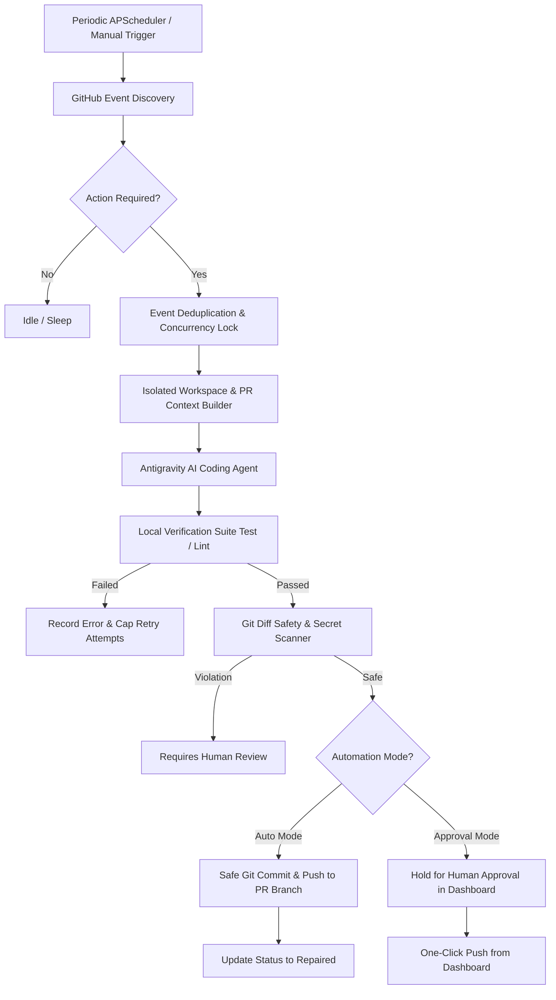

# Autonomous GitHub Pull Request Repair Agent

[](https://www.python.org/downloads/)
[](https://fastapi.tiangolo.com/)
[](https://reactjs.org/)
[](https://tailwindcss.com/)
[](https://opensource.org/licenses/MIT)
[](tests/)

A production-ready autonomous agent for continuous, unattended monitoring and automated surgical repair of GitHub Pull Requests. When code reviews (such as `CHANGES_REQUESTED` or inline comments) or CI workflow checks fail, the application orchestrates an AI coding agent (**Google Antigravity**) to diagnose root causes, prepare isolated workspaces, execute verified code fixes, inspect git diff safety constraints, and push fixes safely back to the PR branch.

---

## 1. Key Capabilities

- **Automated Event Detection**: Continuously monitors repositories for failed GitHub Actions workflow runs, failed check suites, inline code review comments, and change request reviews (`CHANGES_REQUESTED`).
- **Antigravity AI Coding Agent**: Leverages Antigravity (`flash`, `flash_lite`, or `pro` models) with surgical repair prompts tailored strictly to fix reported issues while preserving existing codebase architecture.
- **Enterprise Git Safety Guardrails**:
  - **Zero Force-Pushing**: `--force` is strictly rejected and prohibited at the subprocess layer.
  - **Protected Branch Enforcement**: Automatically blocks pushes to `main`, `master`, `develop`, `release/*`, `staging`, or `production`.
  - **Never Auto-Merges or Closes PRs**: Final review and merge decisions always remain with repository maintainers.
  - **Secret & Sensitive File Scanner**: Diff inspection blocks leaks of API tokens, private keys, `.env`, credentials, or SSH keys before commit/push.
  - **Configurable Diff Thresholds**: Enforces limits on maximum files changed and lines added/deleted.
- **Modern Single-Page SaaS Dashboard**:
  - React 18 SPA styled with Tailwind CSS and flat single-color vector icons (zero emojis).
  - Dual layout views: **Interactive Table View** and **Bento Grid View**.
  - 10-row pagination with jump-to-page navigation and real-time status/repo filters.
  - Full-featured PR details modal with unified git diff viewer and repair history logs.
  - One-click manual actions: **Trigger Repair**, **Approve & Push Fix**, **Stop Automation**.
- **Flexible GitHub Authentication**: Supports GitHub **Device Flow OAuth 2.0** (one-click browser authorization) or **Personal Access Tokens (PAT)**.
- **Multi-Repository & Organization Management**: Monitor and repair across multiple repositories simultaneously with concurrency lock protection.

---

## 2. Architecture & Workflow



### Step-by-Step Lifecycle:
1. **Discovery & Deduplication**: Fetches open PRs and extracts recent CI checks and review comments. Compares event IDs against SQLite to guarantee each comment/job is processed only once.
2. **Context Compilation**: Generates a structured `pr-context.md` inside an isolated workspace (`workspaces/<repo>/pr-<n>`), combining changed files, review comments, CI logs, and repository instruction files (`AGENTS.md`, `CLAUDE.md`, `CONTRIBUTING.md`).
3. **AI Code Repair**: Dispatches the repair task to Antigravity CLI (`agentapi`), instructing it to fix the issue without unnecessary refactoring.
4. **Local Verification**: Executes configured repository commands (`pytest`, `npm test`, `flake8`, `mypy`, `cargo test`, etc.).
5. **Diff Safety Audit**: Verifies change size limits, blocks forbidden files, and scans for secret patterns.
6. **Push Guardrail Enforcement**: Pushes the verified commits strictly to the origin PR branch (`git push origin <PR_BRANCH>`).

---

## 3. Project Structure

```text
github-pr-repair-agent/
├── app/
│   ├── api/
│   │   └── routes.py            # FastAPI REST endpoints for dashboard & actions
│   ├── agent/
│   │   ├── base.py              # CodingAgent interface & RepairResult contract
│   │   ├── antigravity.py       # Antigravity agent adapter (agentapi CLI / SDK)
│   │   ├── context.py           # Context generator (pr-context.md)
│   │   ├── prompts.py           # Surgical PR repair prompt engineering
│   │   └── mock.py              # Mock agent for deterministic testing
│   ├── config/
│   │   ├── settings.py          # Pydantic v2 settings loading from .env
│   │   └── repositories.py      # YAML repository configuration validator
│   ├── database/
│   │   ├── database.py          # Async/sync SQLite session management
│   │   └── models.py            # SQLAlchemy models (PRs, Events, Repairs)
│   ├── github/
│   │   ├── client.py            # Async httpx client with rate-limiting & auth
│   │   ├── prs.py               # PR discovery, details, file patches, and diffs
│   │   ├── reviews.py           # Review detection (CHANGES_REQUESTED)
│   │   ├── comments.py          # Inline code comments & PR discussions
│   │   ├── checks.py            # Check runs and commit statuses
│   │   └── actions.py           # Actions workflow runs & CI log parser
│   ├── monitoring/
│   │   ├── scanner.py           # Core PR repair loop & event deduplicator
│   │   ├── analyzer.py          # Review comment grouping & diagnostic synthesizer
│   │   └── state.py             # Explicit state machine & concurrency locks
│   ├── notifications/
│   │   ├── manager.py           # Notification dispatcher
│   │   ├── console.py           # Rich terminal cards
│   │   ├── slack.py             # Slack Incoming Webhooks
│   │   └── email.py             # SMTP email notifications
│   ├── scheduler/
│   │   └── scheduler.py         # APScheduler background runner
│   ├── verification/
│   │   ├── diff.py              # Git diff safety inspector & secret scanner
│   │   └── runner.py            # Test, lint, and static analysis runner
│   ├── workspace/
│   │   ├── manager.py           # Isolated workspace lifecycle manager
│   │   ├── git.py               # Safe Git subprocess runner & push guardrails
│   │   └── cleanup.py           # Workspace retention & cleanup policy
│   ├── cli.py                   # Click CLI entrypoint (`pr-agent`)
│   └── main.py                  # FastAPI application entrypoint
├── dashboard/
│   └── index.html               # Single-page web dashboard (React 18 + Tailwind CSS)
├── config/
│   └── repositories.yaml        # Monitored repository specifications & check commands
├── tests/                       # 24 automated unit, safety, and E2E tests
├── workspaces/                  # Isolated repair workspace directories
├── logs/                        # Runtime and agent execution logs
├── data/                        # SQLite database storage (pr_agent.db)
├── Dockerfile                   # Production container definition
├── docker-compose.yml           # Multi-volume Docker deployment
├── pyproject.toml               # Python project configuration & dependencies
└── README.md                    # Project documentation
```

---

## 4. Quickstart

### Prerequisites
- **Python**: 3.10 or higher
- **Git**: 2.30+ installed and on `PATH`
- **Antigravity CLI**: `agentapi` installed in your environment
- **Operating System**: macOS or Linux

### Installation
```bash
# Clone the repository
git clone https://github.com/wprashed/github-pr-repair-agent.git
cd github-pr-repair-agent

# Create virtual environment and activate
python3 -m venv .venv
source .venv/bin/activate

# Upgrade pip and install package in editable mode
pip install --upgrade pip
pip install -e ".[dev]"
```

### Environment Configuration
Copy `.env.example` to `.env` and set your credentials:
```bash
cp .env.example .env
```

Example `.env`:
```ini
GITHUB_TOKEN=ghp_your_personal_access_token_here
GITHUB_USERNAME=your_github_username
AUTOMATION_MODE=auto
AGENT_PROVIDER=antigravity
ANTIGRAVITY_MODEL=flash
SCHEDULER_INTERVAL_HOURS=3
REPAIR_MAX_ATTEMPTS=3
```

### Diagnostic System Health Check
Verify your environment and dependencies with the built-in diagnostic tool:
```bash
pr-agent doctor
```

```text
Running PR Repair Agent Doctor Diagnostics...

  ✔ Git installed: git version 2.50.1
  ✔ GITHUB_TOKEN configured: ghp_...
  ✔ Antigravity binary available at: /Users/.../.gemini/antigravity/bin/agentapi
  ✔ Configuration loaded: repositories defined in repositories.yaml
  ✔ SQLite Database initialized at: sqlite:///./data/pr_agent.db

Diagnostics complete.
```

### Start the Service & Web Dashboard
```bash
pr-agent start --port 8000
```
Open your browser to: **`http://localhost:8000`**

---

## 5. Web Dashboard Features

The dashboard provides real-time visibility and control over all tracked repositories and pull requests:

- **Metrics Bar**: Instant stats for Total Monitored PRs, Needs Repair, In Progress, Repaired, and Blocked/Failed.
- **Dual View Modes**: Switch seamlessly between **Interactive Table View** and **Bento Grid / Card View**.
- **Pagination & Filters**:
  - Max 10 rows per page with page jump navigation.
  - Multi-status filter tabs (`ALL`, `NEEDS_REPAIR`, `IN_PROGRESS`, `REPAIRED`, `REQUIRES_HUMAN_REVIEW`, `BLOCKED/FAILED`).
  - Instant search filter by PR Title, PR #, Author, or Branch name.
- **Interactive PR Detail Modal**:
  - **Overview Tab**: PR author, head/base branches, failure diagnosis, and repair attempts history.
  - **Diff Tab**: Live unified syntax-highlighted git diff with file line counts.
  - **History Tab**: Complete timestamped audit trail of agent diagnoses, test outputs, and execution logs.
- **Repository Management**: Add, remove, and sync monitored repositories with custom test and lint rules.
- **Integrations & Settings**:
  - Connect GitHub via **Device Flow OAuth** or **Personal Access Token**.
  - Choose Antigravity model (`flash`, `flash_lite`, `pro`) and test binary connectivity.

---

## 6. Configuration Reference

### Environment Variables (`.env`)

| Variable | Default | Description |
|---|---|---|
| `GITHUB_TOKEN` | *None* | GitHub Personal Access Token or OAuth Token |
| `GITHUB_USERNAME` | *None* | Your GitHub username (used to filter PRs if `only_my_prs: true`) |
| `AUTOMATION_MODE` | `auto` | `auto` (auto commit & push) or `approval` (holds for human review) |
| `AGENT_PROVIDER` | `antigravity` | Agent to use (`antigravity` or `mock`) |
| `ANTIGRAVITY_MODEL` | `flash` | Model selection: `flash`, `flash_lite`, `pro` |
| `ANTIGRAVITY_BIN_PATH` | *Auto-detected* | Path to `agentapi` binary |
| `SCHEDULER_INTERVAL_HOURS` | `3` | Periodic background scan frequency in hours |
| `REPAIR_MAX_ATTEMPTS` | `3` | Max automated repair attempts per PR before halting |
| `SAFETY_MAX_FILES_CHANGED`| `20` | Max changed files allowed in a single repair diff |
| `SAFETY_MAX_LINES_ADDED` | `1000` | Max lines added allowed in a repair diff |
| `SAFETY_MAX_LINES_DELETED`| `1000` | Max lines deleted allowed in a repair diff |
| `SLACK_WEBHOOK_URL` | *None* | Slack Incoming Webhook URL for alerts |

### Repository Configuration (`config/repositories.yaml`)

```yaml
repositories:
  - name: frontend-app
    github: my-org/frontend-app
    enabled: true
    pull_requests:
      only_my_prs: true
      only_open_prs: true
    checks:
      test:
        - "npm test -- --passWithNoTests"
      lint:
        - "npm run lint"
    safety:
      max_files_changed: 15
      max_lines_added: 500
      max_lines_deleted: 500
      allow_new_files: true
      allow_deleted_files: false
    repair:
      max_attempts: 3
```

---

## 7. Safety Invariants & Guardrails

The agent operates under a strict defense-in-depth safety architecture:

| Guardrail | Enforcement Level | Behavior |
|---|---|---|
| **No Protected Branch Pushes** | Subprocess & API | Pushes to `main`, `master`, `develop`, etc. are rejected and aborted immediately. |
| **No Force-Pushes** | Subprocess | `--force` or `+refs` are strictly blocked. |
| **No Automatic PR Closure / Merge** | GitHub Client | The agent has no code path to merge or close pull requests. |
| **Secret Leak Scanner** | Pre-Push Diff Inspector | Blocks tokens, AWS credentials, Slack webhooks, and private RSA/PEM keys. |
| **Forbidden File Protection** | Pre-Push Diff Inspector | Blocks `.env`, `credentials.json`, `id_rsa`, `*.pem`, `*.key`. |
| **Threshold Limits** | Verification Engine | Changes exceeding file or line thresholds transition to `REQUIRES_HUMAN_REVIEW`. |
| **Attempt Caps** | State Machine | Exceeding `max_attempts` halts automation on the PR to prevent infinite loops. |

---

## 8. CLI Reference

```bash
pr-agent --help
```

| Command | Usage | Description |
|---|---|---|
| `connect` | `pr-agent connect` | Interactive configuration for GitHub and Antigravity |
| `doctor` | `pr-agent doctor` | Runs diagnostic health checks on tools and environment |
| `start` | `pr-agent start [--host 0.0.0.0] [--port 8000]` | Starts FastAPI server and background scheduler |
| `scan` | `pr-agent scan [--repo owner/repo] [--pr 123]` | Triggers manual scan across repositories |
| `repair` | `pr-agent repair --repo owner/repo --pr 123` | Forces execution of repair pipeline on a specific PR |
| `status` | `pr-agent status` | Prints a formatted terminal table of monitored PRs |
| `logs` | `pr-agent logs [--limit 10]` | Shows recent repair attempts and output logs |

---

## 9. REST API Reference

| Method | Endpoint | Description |
|---|---|---|
| `GET` | `/api/health` | Service health status and automation mode |
| `GET` | `/api/status` | Aggregated dashboard metric counters |
| `GET` | `/api/pull-requests` | List tracked PRs (supports `status`, `repo`, `page`, `page_size` query params) |
| `GET` | `/api/pull-requests/{id}` | Complete PR details, diagnosis, and latest git diff |
| `GET` | `/api/pull-requests/{id}/repairs`| Full repair attempt audit history |
| `POST` | `/api/scan` | Trigger an immediate scan across all repositories |
| `POST` | `/api/pull-requests/{id}/repair` | Queue a manual repair run for a PR |
| `POST` | `/api/pull-requests/{id}/approve`| Approve verified changes and push to PR branch |
| `POST` | `/api/pull-requests/{id}/stop` | Halt automated repair attempts on a PR |
| `GET` | `/api/repositories` | List monitored repositories |
| `POST` | `/api/repositories` | Add or update monitored repository config |
| `DELETE`| `/api/repositories/{id}` | Remove a repository from monitoring |
| `GET` | `/api/settings/integrations` | Inspect GitHub & Antigravity connection status |
| `POST` | `/api/settings/integrations` | Save GitHub & Antigravity credentials |
| `POST` | `/api/settings/test-github` | Validate GitHub authentication |
| `POST` | `/api/settings/test-antigravity`| Validate Antigravity CLI and model availability |
| `POST` | `/api/auth/github/device/start` | Initialize GitHub Device Flow OAuth |
| `POST` | `/api/auth/github/device/poll` | Poll GitHub Device Flow OAuth completion |

---

## 10. Running Automated Tests

Run the full pytest suite with async support:
```bash
pytest -v tests/
```

Test suite coverage includes:
- **Agent Abstraction & Context Builder**: Verifies surgical prompt formatting and instruction parsing (`tests/test_agent.py`).
- **Diff & Secret Safety**: Tests detection of `.env` files, leaked API secrets, and excessive diffs (`tests/test_diff_safety.py`).
- **Git Push Guardrails**: Verifies rejection of force-pushes, protected branches, and repository mismatches (`tests/test_git_safety.py`).
- **GitHub Integration**: Tests PR listing, change request review detection, and CI log parser (`tests/test_github.py`).
- **State Machine & Locks**: Tests valid state transitions and concurrency locking (`tests/test_state_machine.py`).
- **Verification Runner**: Tests multi-command test/lint execution, timeout handling, and failure capture (`tests/test_verification.py`).
- **End-to-End Workflow**: Full lifecycle simulation from event detection to workspace preparation, agent execution, verification, and database state update (`tests/test_e2e_workflow.py`).

---

## 11. Running with Docker

Deploy with Docker Compose for containerized, persistent background execution:

```bash
# Build and start container
docker-compose up -d --build

# Follow logs
docker-compose logs -f pr-agent
```

Persistent volumes are configured for:
- `data/`: SQLite database storage (`pr_agent.db`)
- `workspaces/`: Isolated repository workspaces
- `logs/`: Application and agent execution logs

---

## 12. License

This project is licensed under the [MIT License](LICENSE).

